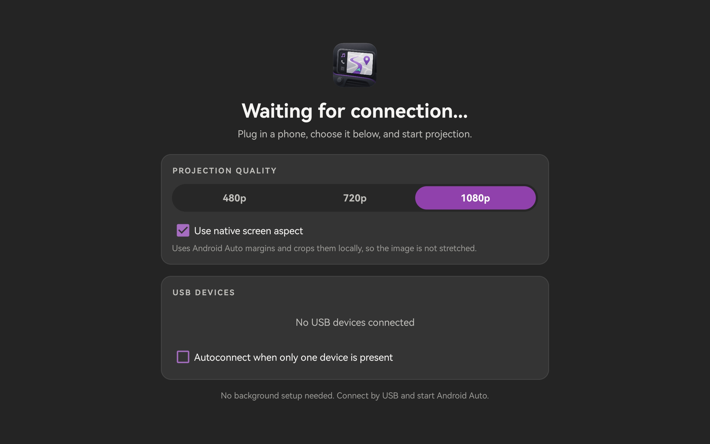
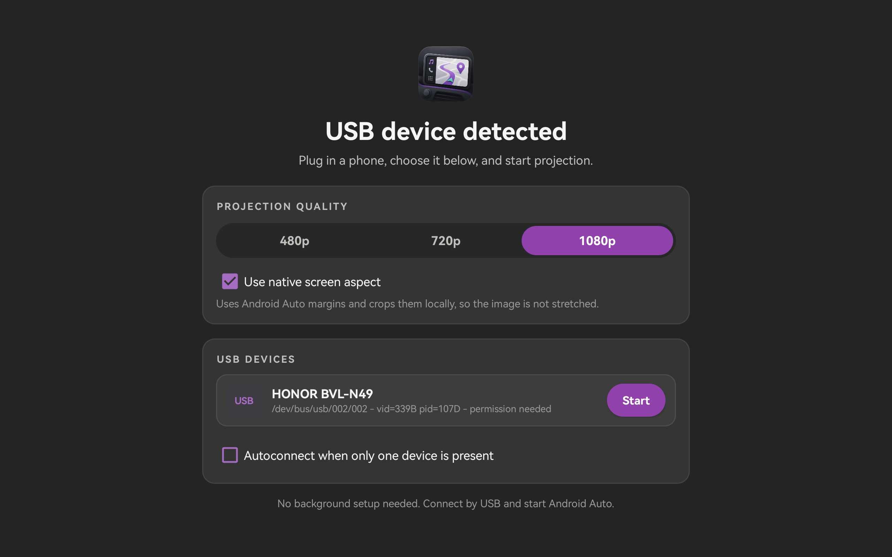

# LibAuto

LibAuto is an Android USB-host head-unit app that runs Android Auto projection on tablets and aftermarket Android head units. It speaks Android Open Accessory / Android Auto over USB, decodes the phone-provided media stream locally, forwards touch/media controls back to the phone, and presents a fullscreen in-car UI.

This project is not affiliated with, endorsed by, sponsored by, or connected to Google, Android, Android Auto, or any vehicle/head-unit vendor. Android, Android Auto, Google, and other product names are trademarks of their respective owners.





## Current Status

LibAuto is usable as an experimental head-unit app. The tested happy path is:

- USB Android Auto starts from a connected Android phone.
- The app can automatically enable AOAP/accessory mode and start projection.
- Video, audio, touch, two-finger gestures, and media keys are implemented.
- GPS-backed vehicle speed and basic fake-car sensors are sent when requested.
- The UI is fullscreen and optimized for 1024x600, 16:10 tablet displays, and common 16:9 projection sizes.

This is still not a certified Android Auto receiver. Expect device-specific behavior, especially on heavily modified Android head units.

## Compatible Platforms

Known working:

- HarmonyOS 4.2 / Android 12 tablet, Snapdragon 865, USB host mode.
- Android aftermarket head units that can install normal APKs and expose USB host devices to apps.

Designed for:

- Android 8.0+ (`minSdk 26`) for the compatibility APK.
- Android 15 target (`targetSdk 35`) for Google Play-style builds.
- `armeabi-v7a` and `arm64-v8a` devices.
- Screens around 800x480, 1024x600, 1280x720, 1920x1080, and native-aspect scaled modes.

Requirements:

- USB host support.
- A cable and port that expose the phone as a USB device to Android.
- Runtime permissions for USB, microphone, and location if you want voice/GPS-backed vehicle data.
- A phone with Android Auto installed and enabled for wired projection.

## Features

- One-tap session start from a connected USB device list.
- Optional autoconnect when exactly one USB device is present.
- Projection quality options: 480p, 720p, 1080p.
- Native-aspect option for non-16:9 head-unit screens.
- Local video rendering with letterbox/fill handling.
- Touch and two-pointer gesture forwarding.
- Hardware/media key forwarding for play, pause, next, previous, and related controls.
- Audio playback through Android `AudioTrack`.
- Microphone channel support for Android Auto voice input.
- Sensor channel support for driving status, night mode, GPS speed, gear, and parking brake.
- Conservative file logging to avoid excessive NAND writes on head units.
- Session reset on disconnect/replug so stale framebuffers do not block the next run.

## Install

Use the compatibility APK for normal sideloading, especially on questionable Android 8/10/14 hybrid head units:

```bash
adb install -r LibAuto-compatibility-release-signed.apk
```

Use the Play flavor for store-style validation and modern target-SDK requirements:

```bash
adb install -r LibAuto-play-release-signed.apk
```

Google Play upload uses the signed AAB:

```text
LibAuto-play-release-signed.aab
```

The Android package/application id is:

```text
ro.stf_ftw.libauto
```

## Usage

1. Open LibAuto on the tablet/head unit.
2. Choose projection quality and whether to use native screen aspect.
3. Plug in the phone.
4. Tap the detected USB device, or enable autoconnect if only one device will be connected.
5. Accept Android Auto prompts on the phone if shown.
6. Use the fullscreen projection view.

If a session ends, unplug/replug the phone or return to the device list and start again. The app intentionally clears the previous decoder/framebuffer state before a new session.

## Build

Prerequisites:

- Android SDK with API 35 platform and build-tools.
- Android NDK 25.1.8937393.
- JDK 17.
- Network access for the first vcpkg/native dependency setup unless the local cache is already populated.

Build both release flavors:

```bash
./gradlew assembleCompatibilityRelease bundlePlayRelease assemblePlayRelease
```

Release outputs before external signing:

```text
app/build/outputs/apk/compatibility/release/LibAuto-compatibility-release-unsigned.apk
app/build/outputs/apk/play/release/LibAuto-play-release-unsigned.apk
app/build/outputs/bundle/playRelease/LibAuto-play-release.aab
```

For current Google Play submissions, Google’s [target API requirement](https://developer.android.com/google/play/requirements/target-sdk) is Android 15 / API 35 or higher for new apps and updates, with exceptions for Wear OS, Android Automotive OS, and Android TV. LibAuto’s `play` flavor targets API 35; the `compatibility` flavor targets API 28 for old/forked head-unit firmware behavior.

## Repository Layout

- `app/`: Android application, UI, projection service, USB manager, media decode/playback, permissions, sensors, and logging.
- `native/`: JNI bridge and Android USB transport used by AASDK.
- `third_party/aasdk-2.1/`: vendored AASDK source used for Android Auto protocol/channel handling.
- `docs/`: screenshots, technical notes, and credits.
- `scripts/`: helper scripts for release packaging.

## Important Limitations

- Android Auto is not a public receiver protocol. Compatibility can change with phone-side Android Auto updates.
- Wireless Android Auto is not implemented as a standalone dongle bridge.
- The app depends on Android USB host behavior. Some car head units block or virtualize USB devices in ways third-party apps cannot access.
- Play Store approval is not guaranteed because projection/head-unit apps may be subject to Google policy review and trademark/product-representation constraints.
- The compatibility APK intentionally targets an older SDK for sideloaded head-unit compatibility; do not upload that flavor to Google Play.

## Documentation

- [Technical Notes](docs/TECHNICAL_NOTES.md) documents the major implementation changes and why they were made.
- [Credits](docs/CREDITS.md) lists project dependencies, research references, and attribution notes.
- [Release Notes](docs/RELEASE.md) documents release flavor outputs and verification commands.

## License

LibAuto project code is intended to be released under GPLv3. See [LICENSE](LICENSE).

Third-party code and dependencies retain their own licenses. Review [Credits](docs/CREDITS.md) and dependency license files before public redistribution.
